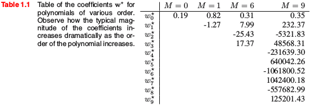

# Chapter 1: introduction

## what is this about?

- automatic recognition of patterns (regularities) in data
- e.g. classifying data into different categories

### OCR example

- canonical example is recognition of handwritten digits
    - variability creates many problems
    - result of training is f(image) -> [chatacters]

### jargon

**target vector** <- real value of the training set examples

**training set** <- examples to train an adaptative model

**training phase** <- shaping of the function f(input) -> output

**test set** <- after training, the function is applied to it to demonstrate its performance

**generalization** <- hability to work correctly on new examples (other than training set).
Because of combinatorial situations, training set is usually ridiculously small vs total space.

### feature extraction (preprocessing)

Original input variables are transformed (preprocessed) into a more suitable *representation*.
This is an area of research by itself... Usually, the idea is to use a **simple** and **efficient**
function that will reduce the variability while keeping the useful information.

Some learning is too slow on big input, therefore it is also useful to remove useless information.

This is a case of modeling, where usefull information can be discarded.

### problem classification and jargon

**supervized learning** <- (input vector -> target vectors) are used to train

**classification problem** <- target vectors are discrete (finite number of distinct classes)

**regression** <- target vector is made of one or more continuous variables (classical stats shit)

**unsupervized learning** <- (input vectors) with no other information is used to train

**clustering problem** <- goal is to find groups of similar examples within the data

**density estimation problem** <- determine the distribution of data within the input space

**visualization** <- project data of high-dimensional space down to 2D or 3D representations

**reinforcement learning** <- learn suitable actions to take in a given
situation to maximize an objective. It must try and sample to maximize the
reward. e.g. with proper training, a neural network can play backgammon
quite well. The representation is a state on the board and the decision is
the move to execute. Usually, the neural network works against itself
for millions of games.

**exploration and exploitation** <- in the context of reinforcement learning,
there is a tradeoff between trying new actions and using good moves previously
learned.

## example: polynomial curve fitting

- simple regression problem
- sin(2*pi*x) + random noise
    - usually data sets have an underlying structure + intrinsically stochastic noise
- use approach based on curve fitting (with polynomials)
    - y(x, w) = w0 + w1*x + w2*x^2 + ... + wm*x^m
    - m <- order of the polynomial
    - need to figure out the proper order of the polynomials and the values of the coefficients
    - total function is not linear, but is linearly dependent on coefficients of the w vector
- fitting is made using an error function
    - simple example is sum of squares
    - E(w) = 1/2 * sum{n=1 to N} ((y(xn, w) - tn)^2)
    - 1/2 is included for later convenience
    - E(w) == 0 then the function passes exactly through each training point
- need to choose M (degree of polynomial) through comparison/model selection
    - we just minimize a load of them and analyze the results
    - M=0, 1 suck, M=3 seems ok and M=9 passes through every point E(w) = 0
      - M=9 sucks at fitting sin(2 * pi * x), this is known as over-fitting
      - aka, it isn't good at generalization
    - over-fitting can be assessed by trying new values of random noise
    - use RMS of error: sqrt(2E(w)/N)
- overfitting polynomials is paradoxical since it contains polynomials of lower orders...
- usually, coefficients in overfitted weight vectors go to extremes to fit very well the data

- increasing the ratio (input data) / polynomial degree reduces overfitting (reduces relative degrees of liberty I suppose)
    - handy heuristic: M < (5 to 10) * data points
    - not always so good

**regularization** <- allows to control over-fitting by adding a penalty on the value of the w vector

**validation by hold-out** <- partition the training set in training set and hold-out test
to test against.

# Chapter 1: probability theory

- consistent framework allowing quantification and manipulation of uncertainty
- very important in pattern recognition

### simple introduction

Image 2 boxes, red, blue. Red = {apple=>2, orange=>6}; Blue = {apple =>3, orange=>1}.

Pick one box, pick random from the box.

**Probability of an event** <- fraction of time the event occurs on total of all events.

**notation**
- P(X=x|Y=y) = conditional probability of X=x given Y=y
- P(X=x, Y=y) = probability of X=x, Y=y

**symmetry property** <- P(X|Y) = P(Y|X) (at least in 2 var systems I suppose)

**sum rule** <- p(X=x) = sum{Y}(p(X=x, Y=yn)), *marginal probability*. obtained by summing out
the other variables.

**product rule** <- p(X=x, Y=y) = p(Y=y|X=x) * p(X=x), probability of Y given X. We observe that
P(X, Y) = P(Y, X), by the symmetry property.

**Baye's theorem** <- P(Y=y | X=x) = (P(X=x | Y=y) * P(Y=y)) /(P(X=x)

~~~
    equivalence relationships with Baye's rule

    Baye's rule: P(Y=y | X=x) = P(X=x | Y=y) * P(Y=y) / P(X=x)

    y | X=XP(X=x |Y=y) * P(Y=y) = P(X=x, Y=y)

    P(X=x, Y=y) / P(X=x) = P(Y=y | X=x)
    eq.
    P(X=x, Y=y) = P(Y=y | X=x) * P(X=x)

    also
~~~

## bayesian probabilities

posterior ∝ likelihood × prior

## gaussian distribution

